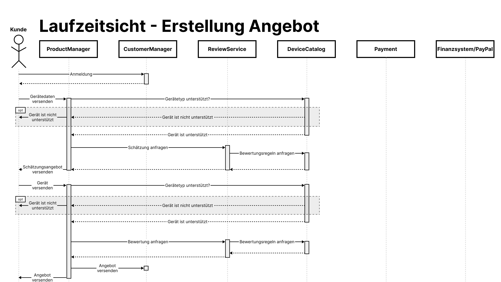
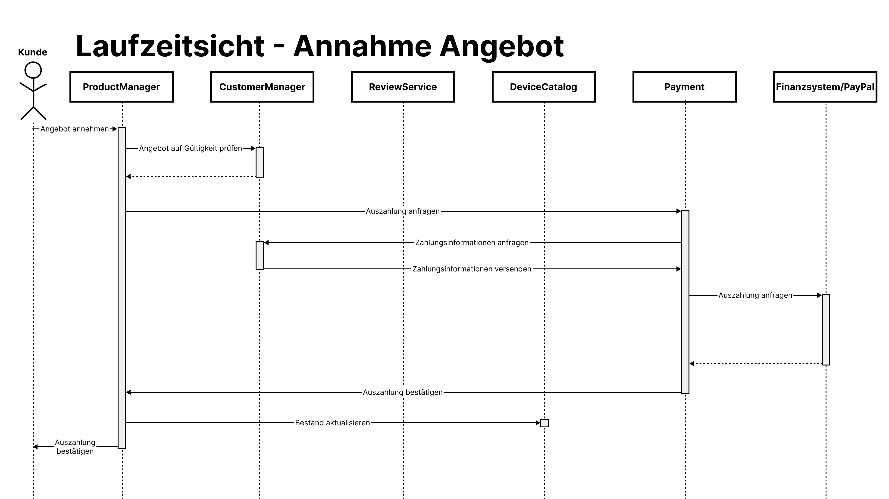

# Einführung und Ziele

## Aufgabenstellung
 

### *Use Case: Geräterücknahme - Anmeldung*
<table>
    <tbody>
        <tr>
            <td>Nummer</td>
            <td>UC-1</td>
        </tr>
        <tr>
            <td>Titel</td>
            <td>Anmeldung</td>
        </tr>
        <tr>
            <td>Akteure und Komponenten
            </td>
            <td>Kunde, CustomerManager</td>
        </tr>
        <tr>
            <td>Ziel</td>
            <td>Ein Kunde möchte sich anmelden.</td>
        </tr>
        <tr>
            <td>Auslöser</td>
            <td>Kunde öffnet Anmeldefenster im Browser</td>
        </tr>
        <tr>
            <td>Vorbedingungen</td>
            <td><li>Kunde ist bereits registriert</li>
            <li> Kunde kennt Email-Adresse für sein Konto</li></td>
        </tr>
        <tr>
            <td>Nachbedingungen
            </td>
            <td><li>Kunde ist angemeldet und kann seine Einsendungen und Angebote verwalten</li></td>
        </tr>
        <tr>
            <td>Erfolgsszenario</td>
            <td>1. Kunde gibt seine Anmeldedaten im Frontend ein   2. CustomerManager prüft Daten und genehmigt Kunden den Zugang   3. Kunde sieht Benutzeroberfläche nach dem Login</td>
        </tr>
        <tr>
            <td>Erweiterungsfälle</td>
            <td>1.1 Kunde hat Passwort vergessen und klickt auf "Passwort vergessen?" 1.2 Kunde gibt seine E-Mail-Adresse an
            und erhält eine Mail, wo das Passwort zurückgesetzt werden kann.</td>
        </tr>
        <tr>
            <td>Fehlerfälle</td>
            <td>2.1 Übrprüfung der Anmeldedaten ist nicht erfolgreich  
                2.2 Kunde wird über fehlgeschlagene Anmeldung informiert</td>
        </tr>
        <tr>
            <td>Häufigkeit</td>
            <td>Einmal die Woche pro Kunde</td>
        </tr>
        <tr>
            <td>Zugrundeliegende Anforerungen</td>
            <td>-</td>
        </tr>
    </tbody>
</table>
 

### *Use Case: Geräterücknahme - Einsendung*
<table>
    <tbody>
        <tr>
            <td>Nummer</td>
            <td>UC-2</td>
        </tr>
        <tr>
            <td>Titel</td>
            <td>Einsendung</td>
        </tr>
        <tr>
            <td>Akteure und Komponenten
            </td>
            <td>Kunde, ProductManager</td>
        </tr>
        <tr>
            <td>Ziel</td>
            <td>Ein eingesendetes Gerät wird im System aufgenommen.</td>
        </tr>
        <tr>
            <td>Auslöser</td>
            <td>Kunde hat Gerät eingesendet.</td>
        </tr>
        <tr>
            <td>Vorbedingungen</td>
            <td><li>Einzusendender Gerätetyp wird unterstützt.</li>
            <li> Kunde ist im Nutzerkonto angemeldet.</li>
            <li> Kunde hat eine Andresse hinterlegt.</li></td>
        </tr>
        <tr>
            <td>Nachbedingungen
            </td>
            <td><li>Einsendung wurde im System aufgenommen.</li>
            <li>Kunde wurde im Frontend über das Eintreffen der Einsendung informiert.</li></td>
        </tr>
        <tr>
            <td>Erfolgsszenario</td>
            <td>1. Kunde kündigt Einsendung im Frontend an und gibt dabei den Gerätetypen der Einsendung an.   
                2. Gerät wird erhalten.  
                3. ProductManager überprüft, ob das erhaltene Gerät wirklich zu dem angegebenen Gerätetypen gehört.  
                4. Nach erfolgreicher Überprüfung nimmt ProductManager das Gerät im System auf.  
                5. ProductManager informiert das Frontend über den erfolgreichen Erhalt des Geräts.</td>
        </tr>
        <tr>
            <td>Erweiterungsfälle</td>
            <td>1.1 Kunde kann auswählen, dass das Gerät gespendet wird.  
                1.2. Es muss anschließend kein Angebot erstellt und somit auch keine Bewertung durchgeführt werden.<td>
        </tr>
        <tr>
            <td>Fehlerfälle</td>
            <td>4.1. Das Gerät entspricht nicht dem angegebenen Gerätetypen  
            OPTION A:  
            4.2.1. Der eigentliche Gerätetyp wird auch unterstützt und das Gerät kann trotzdem bewertet werden.  
            4.2.2. Der Auftrag wird mit dem eigentlichen Gerätetypen aktualisiert. 
            OPTION B:  
            4.3.1. Der eigentliche Gerätetyp wird nicht unterstützt und das Gerät wird an den Kunden zurückgeschickt.  
            4.3.2. Der Kunde wird im Frontend darüber informiert.</td>
        </tr>
        <tr>
            <td>Häufigkeit</td>
            <td>Einmal im Monat pro Kunde</td>
        </tr>
        <tr>
            <td>Zugrundeliegende Anforerungen</td>
            <td>UC-1</td>
        </tr>
    </tbody>
</table>
 

### *Use Case: Geräterücknahme - Bewertung*
<table>
    <tbody>
        <tr>
            <td>Nummer</td>
            <td>UC-3</td>
        </tr>
        <tr>
            <td>Titel</td>
            <td>Bewertung</td>
        </tr>
        <tr>
            <td>Akteure und Komponenten
            </td>
            <td>Mitarbeiter, ProductManager, ReviewService, DeviceCatalog</td>
        </tr>
        <tr>
            <td>Ziel</td>
            <td>Ein eingesendetes Gerät wird bewertet.</td>
        </tr>
        <tr>
            <td>Auslöser</td>
            <td>Ein eingesendetes Gerät wurde im System aufgenommen.</td>
        </tr>
        <tr>
            <td>Vorbedingungen</td>
            <td><li>Ein zu bewertendes Gerät ist vorhanden.</li>
            <li> Gerät wird unterstützt (Regeln zur Bewertung sind vorhanden)</li>
            <li> Der Mitarbeiter befindet sich beim Gerätebewertungsbereich.</li></td>
        </tr>
        <tr>
            <td>Nachbedingungen
            </td>
            <td><li>Bewertung wurde erstellt und ist im DeviceCatalog gespeichert.</li></td>
        </tr>
        <tr>
            <td>Erfolgsszenario</td>
            <td>1. ProductManager fragt die Bewertung beim ReviewService an. 
                2. ReviewService holt sich die Bewertungsegeln aus DeviceCatalog.  
                3. ReviewService generiert aus den Regeln einen Fragenkatalog für den Mitarbeiter.  
                4. Der Mitarbeiter inspiziert das Gerät und füllt den Fragenkatalog aus.  
                5. ReviewService führt mithilfe der Angaben des Mitarbeiters die Bewertung durch und berechnet einen Preis.  
                6. ReviewService sendet Bewertung an DeviceCatalog und ProductManager.</td>
        </tr>
        <tr>
            <td>Erweiterungsfälle</td>
            <td>-<td>
        </tr>
        <tr>
            <td>Fehlerfälle</td>
            <td>-</td>
        </tr>
        <tr>
            <td>Häufigkeit</td>
            <td>Einmal im Monat pro Kunde</td>
        </tr>
        <tr>
            <td>Zugrundeliegende Anforerungen</td>
            <td>UC-1, UC-2</td>
        </tr>
    </tbody>
</table>
 

### *Use Case: Geräterücknahme - Auszahlung*
<table>
    <tbody>
        <tr>
            <td>Nummer</td>
            <td>UC-4</td>
        </tr>
        <tr>
            <td>Titel</td>
            <td>Auszahlung</td>
        </tr>
        <tr>
            <td>Akteure und Komponenten
            </td>
            <td>Kunde, ProductManager, CustomerManager, DeviceCatalog, Payment</td>
        </tr>
        <tr>
            <td>Ziel</td>
            <td>Einem Kunden wird der Preis des bewertetenmeingesendeten Gerät ausgezahlt.</td>
        </tr>
        <tr>
            <td>Auslöser</td>
            <td>Kunde nimmt ein bereits erstelltes Angebot an.</td>
        </tr>
        <tr>
            <td>Vorbedingungen</td>
            <td><li>Kunde hat angegebenes Gerät auch eingeschickt.</li>
            <li> Kunde hat Zahlungsinformationen im Nutzerkonto hinterlegt.</li>
            </td>
        </tr>
        <tr>
            <td>Nachbedingungen
            </td>
            <td><li>Kunde hat Auszahlung bekommen.</li>
            <li>Kunde wurde im Frontend über Auszahlung informiert.</li>
            <li>Bestand wurde aktualisiert.</li></td>
        </tr>
        <tr>
            <td>Erfolgsszenario</td>
            <td>
            1. Kunde nimmt das Angebot über das Frontend an.  
            2. ProductManager überprüft, ob das Gerät wirklich erhalten wurde.  
            3. ProductManager fragt Auszahlung bei Payment an.  
            4. Payment fragt die Zahlungsinformationen des Kunden beim CustomerManager an.  
            5. Payment fragt mithilfe der erhaltenen Zahlungsinformationen die eigentliche Auszahlung beim Finanzsystem an.  
            6. Die Auszahlung wird durchgeführt und eine Bestätigung an Payment geschickt.  
            7. Payment schickt eine Bestätigung an den ProductManager.  
            8. ProductManager löst eine Aktualisierung des Bestands bei DeviceCatalog aus.  
            9. ProductManager bestätigt die Auszahlung beim Frontend des Kunden.</td>
        </tr>
        <tr>
            <td>Erweiterungsfälle</td>
            <td>5.1. Payment fragt mithilfe der erhaltenen Zahlungsinformationen die eigentliche Auszahlung stattdessen bei PayPal an.<td>
        </tr>
        <tr>
            <td>Fehlerfälle</td>
            <td>
                2.1. Das Gerät ist nicht vorhanden und der Prozess wird abgebrochen. Der Kunde wird informiert.  
                2.2. Das fälschliche Angebot wird aus dem System entfernt.  
                4.1. Der Kunde hat noch keine Zahlungsinformationen hinterlegt.  
                4.2. Der Kunde wird aufgefordert, Zahlungsinformationen anzugeben. 
                6.1. Bestätigung wurde nicht erhalten.  
                6.2. Erneute Durchführung von Schritt 5. 
                6.3 Bei dreimaligem Fehlschlagen von Schritt 6 wird die Auszahlung abgebrochen und der Kunde darüber informiert.</td>
        </tr>
        <tr>
            <td>Häufigkeit</td>
            <td>Einmal im Monat bei jedem zweiten Kunden</td>
        </tr>
        <tr>
            <td>Zugrundeliegende Anforerungen</td>
            <td>UC-1, UC-2, UC-3</td>
        </tr>
    </tbody>
</table>

## Qualitätsziele

**Datenschutz und Datenintegrität:**
- Persönliche Daten der Kunden sind geschützt. Kunden können nur auf ihre eigenen Informationen zugreifen. Mitarbeiter sehen nur die relevanten Informationen zur Verarbeitung des Workflows. 

**Bedienbarkeit:**
- Kunden sollten sich einfach auf der Website orientieren können, System soll sehr handlich gestaltet sein. 

**Verlässlichkeit:**
- Das System speichet die von Kunden eingegebenen Daten korrekt. 

**Skalierbarkeit:**
- Das System kann sowohl mit 100 oder auch Millionen von Kunden umgehen. 

## Stakeholder

| Rolle                      | Erwartungshaltung                                                                     |
| -------------------------- | ------------------------------------------------------------------------------------- |
| **Kunden**                 | einfach und unkompliziert sein Gerät minimale benötigte Daten angeben für den Verkauf |
| **Mitarbeiter im Betrieb** | muss koordiniert und reibungslos ablaufen                                             |

# Randbedingungen

# Kontextabgrenzung

## Fachlicher Kontext

**\<Diagramm und/oder Tabelle>**

**\<optional: Erläuterung der externen fachlichen Schnittstellen>**

## Technischer Kontext

**\<Diagramm oder Tabelle>**

**\<optional: Erläuterung der externen technischen Schnittstellen>**

**\<Mapping fachliche auf technische Schnittstellen>**

# Lösungsstrategie

# Bausteinsicht

## Ebene 1

## Ebene 2

### ReviewService

<table>
    <thead>
        <tr>
            <th>Kriterium</th>
            <th>Beschreibung</th>
        </tr>
    </thead>
    <tbody>
        <tr>
            <td>Zweck/Verantwortung</td>
            <td>Preisschätzung: Durchführung einer Preisschätzung mit Angaben des Kunden Vollständige Bewertung: Durchführung der Bewertung mit den angegebenen Bewertungsmerkmalen (Preisberechnung)</td>
        </tr>
        <tr>
            <td>Schnittstellen</td>
            <td>GeräteKatalog: stellt die für die Bewertung benötigten Regeln bereit (getRules) ProduktManager: kann die Erstellung von Bewertungen anfragen (createReview)</td>
        </tr>
        <tr>
            <td>Qualitäts-/ Leistungsmerkmale
            </td>
            <td>Genauigkeit: Preisschätzung soll möglichst akkurat sein (nah an eigentlicher Bewertung) Korrektheit: berechneter Preis entspricht den Bewertungskriterien</td>
        </tr>
        <tr>
            <td>Offene Probleme/Risiken</td>
            <td>Mitarbeiter können bei der Bewertung auf noch unbekannte technische Probleme stoßen (für diese gibt es noch keine Fragen im Fragenkatalog)</td>
        </tr>
    </tbody>
</table>

#### Schnittstellen

<table>
    <thead>
        <tr>
            <th>Schnittstelle</th>
            <th>Vorbedingung</th>
            <th>Nachbedingung</th>
        </tr>
    </thead>
    <tbody>
        <tr>
            <td><code>createReview( &emsp;DeviceType, &emsp;List&lt;Properties&gt; )</code></td>
            <td>Gerätetyp wird unterstützt, Produkteigenschaften müssen vorhanden sein</td>
            <td>eine korrekte Bewertung des angegebenen Geräts wurde zurückgegeben</td>
        </tr>
        <tr>
            <td><code>getRules(DeviceType)</code></td>
            <td>Gerätetyp wird unterstützt</td>
            <td>Regeln werden zurückgegeben</td>
        </tr>
    </tbody>
</table>

### DeviceCatalog

<table>
    <thead>
        <tr>
            <th>Kriterium</th>
            <th>Beschreibung</th>
        </tr>
    </thead>
    <tbody>
        <tr>
            <td>Zweck/Verantwortung</td>
            <td>
                <ul>
                    <li>Verwaltung der unterstützten Gerätetypen </li>
                    <li>nimmt 5-10 neue Gerätetypen pro Monat auf </li>
                    <li>sollte es zu einem bereits unterstützten Gerätetypen ein Jahr lang keine Einsendungen geben, wird dieser aus dem Angebot entfernt </li>
                    <li>speichert Informationen zu den Gerätetypen: </li>
                    <li>Bewertungskriterien </li>
                    <li>Preis </li>
                    <li>mögliche verwertbare Subkomponenten/Teile </li>
                    <li>Anzahl eingesendeter Geräte </li>
                    <li>Zeitpunkt der Einsendungen</li>
                </ul>
            </td>
        </tr>
        <tr>
            <td>Schnittstellen</td>
            <td>
                <li>BewertungsService: greift auf die gespeicherten Regeln zu einem Gerätetypen zu (getRules) </li>
                <li>ProduktManager: kann anfragen, ob ein Gerät unterstützt wird (isSupportedType) </li>
                <li>ProduktManager: kann Unterstützung eines neuen Gerätetyps anfragen (addSupportedType) </li>
                <li>GeräteDatenbank: stellt Daten zu den Gerätetypen bereit (z.B. getNumberOfDevices) </li>
                <li>ERP-System: wird über Änderungen bezüglich der Unterstützung von Gerätetypen und erhaltenen Geräten informiert (informERP)</td>
            </li>
        </tr>
        <tr>
            <td>Qualitäts-/ Leistungsmerkmale</td>
            <td>
                <li>Korrektheit: die gespeicherten Information müssen korrekt sein </li>
                <li>Aktualität: die gespeicherten Informationen dürfen nicht veraltet sein</li>
            </td>
        </tr>
        <tr>
            <td>Offene Probleme/Risiken</td>
            <td>
                <li>mögliche Duplizierung von Daten, die schon im ERP-System gespeichert werden</li>
            </td>
        </tr>
    </tbody>
</table>

#### Schnittstellen

<table>
    <thead>
        <tr>
            <th>Schnittstelle</th>
            <th>Vorbedingung</th>
            <th>Nachbedingung</th>
        </tr>
    </thead>
    <tbody>
        <tr>
            <td><code>getRules(DeviceType)</code></td>
            <td>Gerätetyp wird unterstützt</td>
            <td>Regeln werden zurückgegeben</td>
        </tr>
        <tr>
            <td><code>isSupportedType(DeviceType)</code></td>
            <td>Gerät wurde eingesendet</td>
            <td>Rückgabe, ob der angegebene Gerätetyp unterstützt wird</td>
        </tr>
        <tr>
            <td><code>addSupportedType(DeviceType)</code></td>
            <td>Gerätetyp wird (noch) nicht unterstützt</td>
            <td>Gerätetyp wird unterstützt</td>
        </tr>
        <tr>
            <td><code>getNumberOfDevices(DeviceType)</code></td>
            <td>Gerätetyp wird unterstützt und ist in GeräteDatenbank gespeichert</td>
            <td>Anzahl der Geräte wird an GeräteKatalog zurückgegeben</td>
        </tr>
        <tr>
            <td><code>informERP(List&lt;Device&gt;)</code></td>
            <td>Daten sind mit ERP-System kompatibel</td>
            <td>ERP-System ist über die neuen Informationen informiert</td>
        </tr>
    </tbody>
</table>

# Laufzeitsicht

## *\<Laufzeitsicht - Gesamtszenario>*

-   

-   \<hier Besonderheiten bei dem Zusammenspiel der Bausteine in diesem
    Szenario erläutern>

## *\<Laufzeitsicht - Erstellung Angebot>*

-   

-   \<hier Besonderheiten bei dem Zusammenspiel der Bausteine in diesem
    Szenario erläutern>

## *\<Laufzeitsicht - Annahme Angebot>*
-   

-   \<hier Besonderheiten bei dem Zusammenspiel der Bausteine in diesem
    Szenario erläutern>

# Verteilungssicht

## Infrastruktur Ebene 1

Begründung  
*\<Erläuternder Text>*

Qualitäts- und/oder Leistungsmerkmale  
*\<Erläuternder Text>*

Zuordnung von Bausteinen zu Infrastruktur  
*\<Beschreibung der Zuordnung>*

## Infrastruktur Ebene 2

### *\<Infrastrukturelement 1>*

*\<Diagramm + Erläuterungen>*

### *\<Infrastrukturelement 2>*

*\<Diagramm + Erläuterungen>*

…

### *\<Infrastrukturelement n>*

*\<Diagramm + Erläuterungen>*

# Querschnittliche Konzepte

## *\<Konzept 1>*

*\<Erklärung>*

## *\<Konzept 2>*

*\<Erklärung>*

…

## *\<Konzept n>*

*\<Erklärung>*

# Architekturentscheidungen

# Qualitätsanforderungen

**Weiterführende Informationen**

Siehe [Qualitätsanforderungen](https://docs.arc42.org/section-10/) in
der online-Dokumentation (auf Englisch!).

## Qualitätsbaum

## Qualitätsszenarien

# Risiken und technische Schulden

# Glossar

| Begriff        | Definition        |
| -------------- | ----------------- |
| *\<Begriff-1>* | *\<Definition-1>* |
| *\<Begriff-2>* | *\<Definition-2>* |
